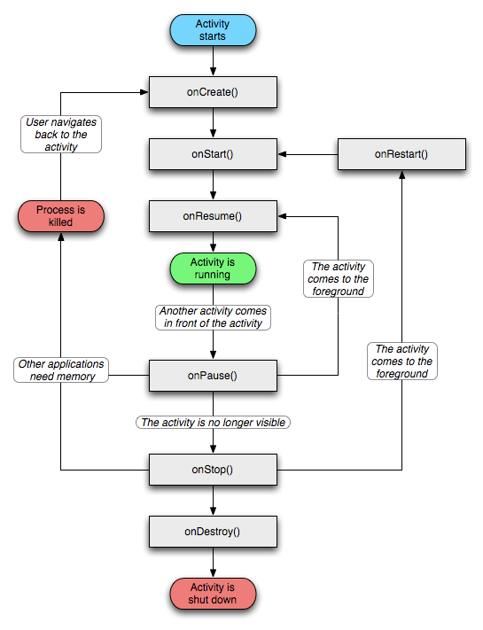

   
    <h2><strong>Reproductor Ciclo de vida Android App</strong>    </h2>
    Juan Pino Contreras.

****

Este proyecto consiste en un reproductor de música básico que permite reproducir, pausar y cambiar canciones. Con el propósito de comprender y demostrar el ciclo de vida de una aplicación Android se presenta el ciclo de vida de una actividad de Android mediante logs en el Logcat.

## 📲 Diagrama ciclo de vida android

#### _Gracias por tu interés en este proyecto. Si tienes algun comentario o duda sobre este o cualquier otro proyecto no dudes en contactarme._
###### 👋